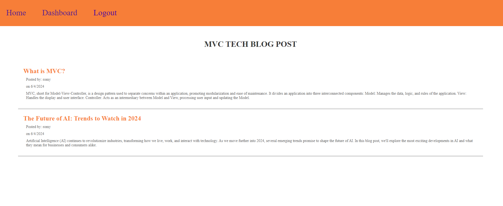

  ## Project Title 
  MVC_TECH_BLOG_CHALLENGE
  ## Screenshot
  
  ## License
   
  ## Description
  This is an app where the user can post, he can also edit and update the post and can comment also. But before the user can do all that he need to sign up and log in first.
  ## Table of Contents
  * [Installation](#installation)
  * [How to Use This Application](#usage)
  * [Contributing](#contributors)
  * [Testing](#testing)
  * [Questions](#questions)
  ## Installation
  npm start
  ## Heroku Deployed Application
  https://mvc-tech-chalenge-eacbb274e204.herokuapp.com/

  ## Contributors
  contributions are welcome
  ## Testing
  none
  ## Questions
  Please send your questions @ Email: romymortilpisigan@gmail.com or 
  Visit GitHub: (https://github.com/Romy52112).
  